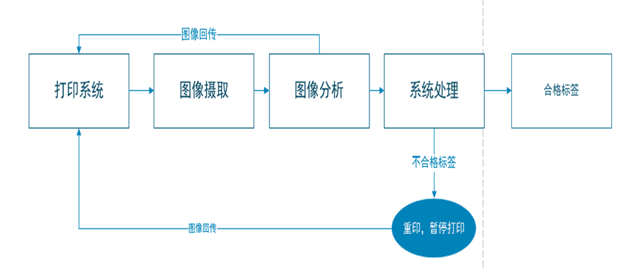

# 机器视觉标签检测

# 流程

# 开发工具
- Visual Stdio 2022

# 案例视频
<video src="../docs/ocr-1.mp4" controls>
  你的浏览器不支持 <code>video</code> 标签。
</video>

# 行业公司
1. [苏州浩克](http://www.hawkeyemv.com/Product/Details_13.htm)
2. [合肥通视](http://www.hftszn.cn/display/119790.html)
3. [山东明佳](http://www.mingjiachina.com/channels/3.html)
4. [喷码产品视觉检测案例分享](https://www.eamar.com.cn/archives/7697)

# 相关文档
1. [基于机器视觉自动标签检测系统CIS54](http://www.shouma.com/index.php/product/detail/id/217/pid/2/parent/123.html)
2. [什么，你还在用人工检测标签印刷问题？](https://www.bilibili.com/video/BV1sv4y1T7Qo/?spm_id_from=333.788.recommend_more_video.0&vd_source=212ecf7c7660ffe5d293c4ba292e2a70)